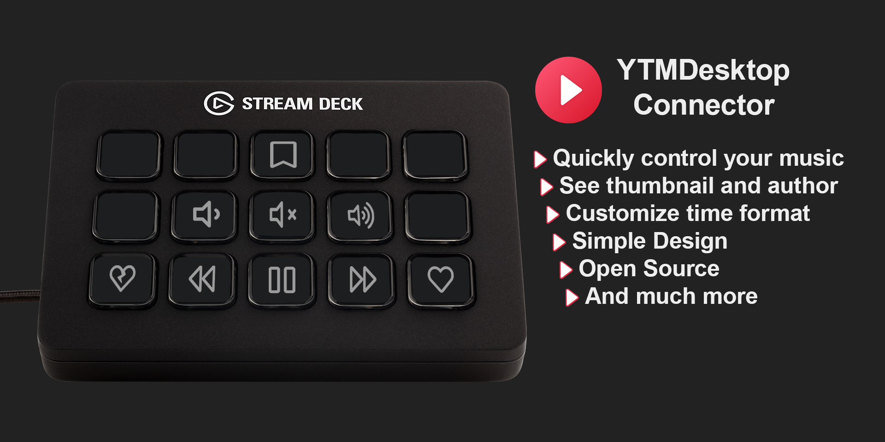

# 1. Table of content
- [1. Table of content](#1-table-of-content)
- [2. Badges](#2-badges)
- [3. What is this Plugin?](#3-what-is-this-plugin)
- [4. Support / Feedback](#4-support--feedback)
- [5. Actions](#5-actions)
- [6. How to use it?](#6-how-to-use-it)
- [7. How to contribute?](#7-how-to-contribute)

# 2. Badges

# 3. What is this Plugin?
This Stream Deck Plugin allows you to control the [YouTube Music Desktop App](https://github.com/ytmdesktop/ytmdesktop)

> [!NOTE]
> we only support version 2.x.x and above, if you are using an older version, please update to the latest version.

# 4. Support / Feedback
You found a bug? You have a feature request? I would love to hear about it [here](https://github.com/XeroxDev/YTMD-StreamDeck/issues/new/choose) or click on the "Issues" tab here on the GitHub repositorie!

You can also join my discord [here](https://x.xeroxdev.de/s/discord)

# 5. Actions

- Play / Pause Track
- Next Track
- Previous Track
- Like Track
- Dislike Track
- Volume Mute
- Volume Down
- Volume Up
- Track Info
  - Shows a scrolling text for album, title and author
  - Shows the thumbnail of the track
- Shuffle
- Repeat
  - NONE
  - ALL
  - ONE

# 6. How to use it?
> [!NOTE]
> This is just a simplified version, please visit the [official documentation](https://help.xeroxdev.de/en/stream-deck/ytmd/home#h-5-how-to-use-it) for a more detailed guide.

1. Install the [YouTube Music Desktop App](https://github.com/ytmdesktop/ytmdesktop).
2. Install the Plugin from [Releases](https://github.com/XeroxDev/YTMD-StreamDeck/releases) or from the official Stream Deck Store.
3. Add Play/Pause action
4. Insert, if not already correct, the settings to YTMDesktop (eg. Host and Port)
5. Make sure the YTMDesktop App and the Companion Server is running
   - To start the companion server, click at the top right of YTMDesktop on the settings gear
   - Go on the left side on the "Integrations" tab
   - Enable the "Companion Server"
6. Turn on "enable companion authorization" under the Companion Server
7. Press the Authorize button in the Play/Pause action settings
8. Compare the authorization code displaying by the plugin with the one displaying in the YTMDesktop App
9. If they match, confirm the authorization in the YTMDesktop App
10. You are ready to go! (Steps 6-9 are only needed once/when the plugin isn't authorized)

# 7. How to contribute?

Just fork the repository and create PR's.

> [!NOTE]
> We're using [release-please](https://github.com/googleapis/release-please) to optimal release the plugin.
> release-please is following the [conventionalcommits](https://www.conventionalcommits.org) specification.
